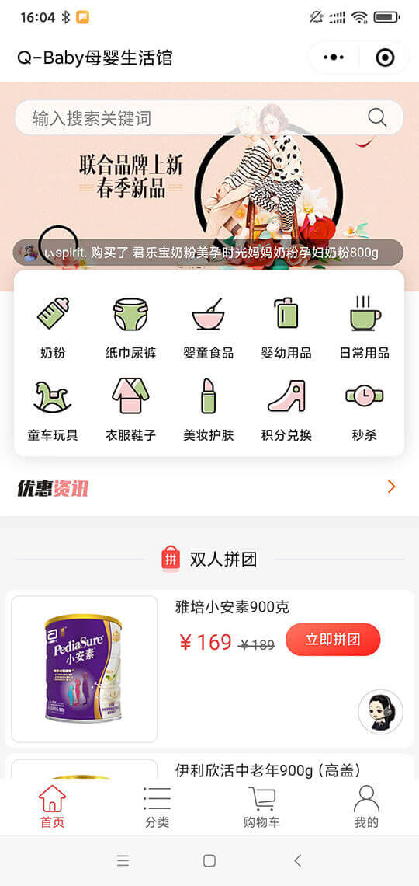
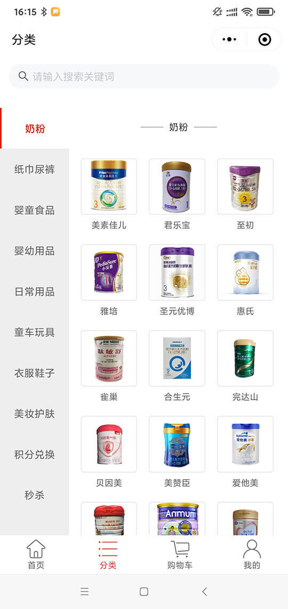
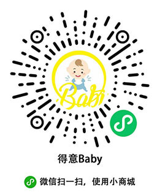

# DeYiBabyWechatShop
得意baby母婴微信小商城完整源代码

[B站开发过程视频](https://www.bilibili.com/video/BV1jh411k72D/)

# 先看效果

一般奶粉厂商控制渠道价格，在得意baby商城上的产品价格不能标低，正规公司，联系客服会得到非常实惠的价格。

# 开发缘由
个人开发者在开发[《手机盘》](http://www.bestsellmall.com)的时候，深感项目特别没前途。就为家里人开的母婴店做一个微信小商城《得意baby》。为了能快速完成，在网上找了开源项目，最后找到EastWorldwechat-app-mall，但是没有服务端。只好自己用golang写一个。

# 技术介绍
《得意baby》客户端在开源项目EastWorld/wechat-app-mall的基础上，进行性能优化和修改。然后加上简单粗糙的管理后台界面，可以上架和下架商品，查看订单等。整体代码没做多少改变，代码质量一般般，只能凑合着使用。

服务器端选择了golang的iris框架从零开发，可以运行在Windows、Mac和Linux等系统上。《得意baby》的目标用户是个体实体店，访问用户不多，日常维护费用低廉，操作简单等。为了效率，启动的时候，一次性把全部商品数据和用户数据从数据库加载到内存，发生改变的时候，才更新到数据库。本人游戏行业，第一次做商城项目，在开发《手机盘》期间，靠拼凑时间完成，更多追求开发速度。

# 商品发布                
商品发布有两种方式，一种是上传Excel表格商品数据，程序转化成json格式，然后读取导入数据库中。另一种是通过小程序粗糙界面编辑上传导入。其外还有一种，通过扫条形码录入商品，先把收银系统后台的商品数据通过Excel表格导出，然后通过扫条形码选择录入商品。

# 运营的一些问题
录入商品数据，是个枯燥的低产值的苦力活。使用Excel表格，可以大幅降低录入时间。
得意baby商城部署只有一个服务器。商品数据走非443端口，图片资源走443端口（CDN只加速web端口），两者要使用不同的域名（比如,https://www.xxx.com:518和https://res.xxx.com:443）。这样做，是为了使用内容分发网络CDN，加速分流图片资源（https://res.xxx.net:443），减轻服务器负担，云服务器费用，特别是宽带费用非常昂贵，个体实体店是无法承担的。
得意baby商城，购买了[腾讯云特惠云服务器](https://curl.qcloud.com/ZlL1p2dM)，1核2G3M三年只要500元，足够个体实体店使用了。

# 把商城跑起来
## 客户端
直接使用微信小程序开发IDE工具打开即可

## 服务器端
服务端分三种模式，一种模式是数据服务模式，一种是资源服务模式，最后一种是自动生成代码和Excel转换json程序。
为了方便下载源代码，已把商城的商品图片全部删除。
Linux已配置相关启动shell脚本./run.sh

+ 运行终端或者命令行

`
cd xxx/DeYiBabyWechatShop/server/src/bestsell
`

./config.json是数据服务器程序的启动配置文件，./configres.json是资源服务器的启动配置文件。
在mysql建好数据库即可。因为gorm可以自动把数据结构创建对应的SQL表格。
配置好上诉两个文件。包括https的证书等。

+ Excel表转Json和图片转换成发布形式

`
go run ./main.go -m excel -c ./config.json
`

+ 启动资源服务器

`
go run ./main.go -c ./configres.json
`

+ 启动数据服务器

`
go run ./main.go -c ./config.json
`

+ 注意事项

一个域名可以配置多少个子域名。
数据服务器可以配置子域名https://api.xxx.com:518
资源服务器可以配置子域名https://res.xxx.com:443
可以运行到一台云主机上，把443端口留给资源服务器，使用CDN加速此端口资源，即可。

# 联系方式
[http://www.bestsellmall.com](http://www.bestsellmall.com)
QQ群：963944097
